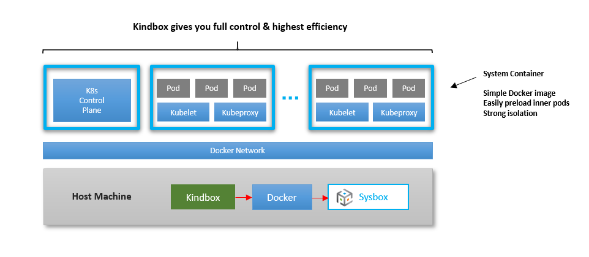

## Introduction

Kindbox is a simple open-source tool created by Nestybox to easily create K8s clusters with Docker + Sysbox.

Check out this [video](https://asciinema.org/a/VCgF094wb4CuVeI8h3iDKhh5m?speed=1.75).

<p align="center"></p>

Kindbox does some of the same things that the K8s.io KinD tool does (e.g., cluster
creation, destruction, etc.) but it's much simpler, more flexible, does not
require complex container images, and it's even more efficient.

Kindbox is not meant to compete with the K8s.io KinD tool. Rather, it's meant to
provide a reference example of how easy it is to deploy a K8s cluster inside
containers when using the Sysbox container runtime.

Kindbox is a simple bash script wrapper around Docker commands. Feel free to
modify it to fit your needs.

## Kindbox Simplicity & Flexibility

Kindbox is a very simple and flexible tool: it's a bash script wrapper around
Docker commands that create, destroy, and resize a Kubernetes-in-Docker cluster.

That is, Kindbox talks to Docker, Docker talks to Sysbox, and Sysbox creates or
destroys the containers.

The reason the tool is so simple is that the Sysbox container runtime creates
the containers such that they can run K8s seamlessly inside. Thus, Kindbox need
only deploy the containers with Docker and run `kubeadm` within them to set them
up. **It's that easy**.

For this same reason, no specialized Docker images are needed for the containers
that act as K8s nodes. In other words, the K8s node image does not require
complex entrypoints or complex Docker commands for its deployment.

This in turn enables you to fully control the contents of the images that make
up the k8s nodes, as well as the process for launching the K8s cluster.

## Using Kindbox

By default, Kindbox uses a Docker image called `nestybox/k8s-node` for the containers
that make up the cluster.

It's a simple image that includes systemd, Docker, the K8s `kubeadm` tool, and
preloaded inner pod images for the K8s control plane.

The Dockerfile is [here](https://github.com/nestybox/sysbox-external/tree/master/dockerfiles/k8s-node).

Feel free to copy it and customize it per your needs.

### Cluster Creation

1) Create a cluster called `mycluster` with 10 nodes (1 master + 9 workers):

```console
$ kindbox create --num-workers=9 mycluster

Creating a K8s cluster with Docker + Sysbox ...

Cluster name             : mycluster
Worker nodes             : 9
Docker network           : mycluster-net
Node image               : nestybox/k8s-node:v1.18.2
K8s version              : v1.18.2
Publish apiserver port   : false

Creating the K8s cluster nodes ...
  - Creating node mycluster-master
  - Creating node mycluster-worker-0
  - Creating node mycluster-worker-1
  - Creating node mycluster-worker-2
  - Creating node mycluster-worker-3
  - Creating node mycluster-worker-4
  - Creating node mycluster-worker-5
  - Creating node mycluster-worker-6
  - Creating node mycluster-worker-7
  - Creating node mycluster-worker-8

Initializing the K8s master node ...
  - Running kubeadm init on mycluster-master ... (may take up to a minute)
  - Setting up kubectl on mycluster-master ...
  - Initializing networking (flannel) on mycluster-master ...
  - Waiting for mycluster-master to be ready ...

Initializing the K8s worker nodes ...
  - Joining the worker nodes to the cluster ...

Cluster created successfully!

Use kubectl to control the cluster.

1) Install kubectl on your host
2) export KUBECONFIG=${KUBECONFIG}:${HOME}/.kube/mycluster-config
3) kubectl config use-context kubernetes-admin@mycluster
4) kubectl get nodes

Alternatively, use "docker exec" to control the cluster:

$ docker exec mycluster-master kubectl get nodes
```

This takes Kindbox less than 2 minutes and consumes &lt; 1GB overhead on my laptop
machine!

In contrast, this same cluster requires 2.5GB when using K8s.io KinD +
Sysbox, and 10GB when using K8s.io KinD without Sysbox.

This means that with Sysbox, you can deploy large and/or more K8s clusters on
your machine quickly and without eating up your disk space.

2) Setup kubectl on the host so we can control the cluster:

(This assumes you've [installed kubectl](https://kubernetes.io/docs/tasks/tools/install-kubectl/) on your host).

```console
$ export KUBECONFIG=${KUBECONFIG}:${HOME}/.kube/mycluster-config

$ kubectl config use-context kubernetes-admin@mycluster
Switched to context "kubernetes-admin@mycluster".
```

3) Use kubectl to verify all is good:

```console
$ kubectl get nodes
NAME                 STATUS   ROLES    AGE     VERSION
mycluster-master     Ready    master   4m43s   v1.18.3
mycluster-worker-0   Ready    <none>   3m51s   v1.18.3
mycluster-worker-1   Ready    <none>   3m53s   v1.18.3
mycluster-worker-2   Ready    <none>   3m52s   v1.18.3
mycluster-worker-3   Ready    <none>   3m53s   v1.18.3
mycluster-worker-4   Ready    <none>   3m51s   v1.18.3
mycluster-worker-5   Ready    <none>   3m52s   v1.18.3
mycluster-worker-6   Ready    <none>   3m50s   v1.18.3
mycluster-worker-7   Ready    <none>   3m50s   v1.18.3
mycluster-worker-8   Ready    <none>   3m50s   v1.18.3
```

From here on, we use kubectl as usual to deploy pods, services, etc.

For example, to create an nginx deployment with 10 pods:

```console
$ kubectl create deployment nginx --image=nginx
$ kubectl scale --replicas=10 deployment nginx
$ kubectl get pods -o wide
NAME                    READY   STATUS    RESTARTS   AGE   IP            NODE                 NOMINATED NODE   READINESS GATES
nginx-f89759699-6ch9m   1/1     Running   0          21s   10.244.11.4   mycluster-worker-6   <none>           <none>
nginx-f89759699-8jrc8   1/1     Running   0          21s   10.244.10.4   mycluster-worker-5   <none>           <none>
nginx-f89759699-dgxq8   1/1     Running   0          28s   10.244.2.15   mycluster-worker-1   <none>           <none>
nginx-f89759699-hx5tt   1/1     Running   0          21s   10.244.5.15   mycluster-worker-3   <none>           <none>
nginx-f89759699-l9v5p   1/1     Running   0          21s   10.244.1.10   mycluster-worker-0   <none>           <none>
nginx-f89759699-pdnhb   1/1     Running   0          21s   10.244.12.4   mycluster-worker-4   <none>           <none>
nginx-f89759699-qf46b   1/1     Running   0          21s   10.244.2.16   mycluster-worker-1   <none>           <none>
nginx-f89759699-vbnx5   1/1     Running   0          21s   10.244.3.14   mycluster-worker-2   <none>           <none>
nginx-f89759699-whgt7   1/1     Running   0          21s   10.244.13.4   mycluster-worker-8   <none>           <none>
nginx-f89759699-zblsb   1/1     Running   0          21s   10.244.14.4   mycluster-worker-7   <none>           <none>
```

### Cluster Network

With Kindbox, you have full control over the container network used by the
cluster.

For example, you can deploy the cluster on a Docker network that you create:

    $ docker network create mynet
    $ kindbox create --num-workers=9 --net mynet mycluster

Normally each cluster would be on a dedicated network for extra isolation, but
it's up to you to decide. If you don't choose a network, Kindbox automatically
creates one for the cluster (with the name `<cluster-name>-net`).

### Cluster Resizing

Kindbox also allows you to easily resize the cluster (i.e., add or remove worker
nodes).

Here we resize the cluster we previously created from 9 to 4 worker nodes.

```console
$ kindbox resize --num-workers=4 mycluster

Resizing the K8s cluster (current = 9, desired = 4) ...
  - Destroying node mycluster-worker-4
  - Destroying node mycluster-worker-5
  - Destroying node mycluster-worker-6
  - Destroying node mycluster-worker-7
  - Destroying node mycluster-worker-8
Done (5 nodes removed)
```

Then verify K8s no longer sees the removed nodes:

```console
$ kubectl get nodes
NAME                 STATUS   ROLES    AGE   VERSION
mycluster-master     Ready    master   32m   v1.18.3
mycluster-worker-0   Ready    <none>   31m   v1.18.3
mycluster-worker-1   Ready    <none>   31m   v1.18.3
mycluster-worker-2   Ready    <none>   31m   v1.18.3
mycluster-worker-3   Ready    <none>   31m   v1.18.3
```

You can also verify K8s has re-scheduled the pods away to the remaining nodes:

```console
$ kubectl get pods -o wide
NAME                    READY   STATUS    RESTARTS   AGE   IP            NODE                 NOMINATED NODE   READINESS GATES
nginx-f89759699-dgxq8   1/1     Running   0          10m   10.244.2.15   mycluster-worker-1   <none>           <none>
nginx-f89759699-hx5tt   1/1     Running   0          10m   10.244.5.15   mycluster-worker-3   <none>           <none>
nginx-f89759699-l6l7b   1/1     Running   0          28s   10.244.5.16   mycluster-worker-3   <none>           <none>
nginx-f89759699-l9v5p   1/1     Running   0          10m   10.244.1.10   mycluster-worker-0   <none>           <none>
nginx-f89759699-nbd2l   1/1     Running   0          28s   10.244.2.17   mycluster-worker-1   <none>           <none>
nginx-f89759699-qf46b   1/1     Running   0          10m   10.244.2.16   mycluster-worker-1   <none>           <none>
nginx-f89759699-rfklb   1/1     Running   0          28s   10.244.1.11   mycluster-worker-0   <none>           <none>
nginx-f89759699-tr9tr   1/1     Running   0          28s   10.244.1.12   mycluster-worker-0   <none>           <none>
nginx-f89759699-vbnx5   1/1     Running   0          10m   10.244.3.14   mycluster-worker-2   <none>           <none>
nginx-f89759699-xvx52   1/1     Running   0          28s   10.244.3.15   mycluster-worker-2   <none>           <none>
```

When resizing the cluster upwards, Kindbox allows you to choose the container
image for newly added K8s nodes:

```console
$ kindbox resize --num-workers=5 --image=<my-special-node> mycluster
```

This means you can have a K8s cluster with a mix of different node images. This
is useful if you need some specialized K8s nodes.

### Multiple Clusters

You can easily create multiple K8s clusters on the host by repeating the
`kindbox create` command (step (1) above).

And you can use `kubectl config use-context` to point to the cluster you wish to
manage (see step (2) above).

On my laptop (4 CPU & 8GB RAM), I am able to create three small clusters without
problem:

```console
$ kindbox list -l
NAME                   WORKERS         NET                  IMAGE                          K8S VERSION
cluster3               5               cluster3-net         nestybox/k8s-node:v1.18.2      v1.18.2
cluster2               5               cluster2-net         nestybox/k8s-node:v1.18.2      v1.18.2
mycluster              4               mycluster-net        nestybox/k8s-node:v1.18.2      v1.18.2
```

With Sysbox, the clusters are well isolated from each other: the K8s nodes are in
containers strongly secured via the Linux user namespace, and each cluster is in
a dedicated Docker network (for traffic isolation).

### Cluster Destruction

To destroy a cluster, simply type:

```console
$ kindbox destroy mycluster
Destroying K8s cluster "mycluster" ...
  - Destroying node mycluster-worker-0
  - Destroying node mycluster-worker-1
  - Destroying node mycluster-worker-2
  - Destroying node mycluster-worker-3
  - Destroying node mycluster-master

Cluster destroyed. Remove stale entry from $KUBECONFIG env-var by doing ...

  export KUBECONFIG=`echo ${KUBECONFIG} | sed "s|:${HOME}/.kube/mycluster-config||"`
```

To see what else you can do with Kindbox, type `kindbox help`.

And remember, it should be fairly easy to add functionality to Kindbox, as it's
just a bash wrapper around Docker commands that manage the cluster.

If you would like Nestybox to add more functionality, please file an
[issue](docs/issue-guidelines.md) in the Sysbox Github repo, or [contact us](#support).

## Support

Reach us at our [slack channel][slack] or at `contact@nestybox.com` for any questions.
See our [contact info](#contact) below for more options.

## About Nestybox

[Nestybox](https://www.nestybox.com) enhances the power of Linux containers.

We are developing software that enables containers to run **any type of
workload** (not just micro-services), and do so easily and securely.

Our mission is to provide users with a fast, efficient, easy-to-use, and secure
alternative to virtual machines for deploying virtual hosts on Linux.

## Contact

We are happy to help. You can reach us at:

Email: `contact@nestybox.com`

Slack: [Nestybox Slack Workspace][slack]

Phone: 1-800-600-6788

We are there from Monday-Friday, 9am-5pm Pacific Time.

## Thank You

We thank you **very much** for using Kindbox. We hope you find it useful.

Your trust in us is very much appreciated.

\-- _The Nestybox Team_

[slack]: https://join.slack.com/t/nestybox-support/shared_invite/enQtOTA0NDQwMTkzMjg2LTAxNGJjYTU2ZmJkYTZjNDMwNmM4Y2YxNzZiZGJlZDM4OTc1NGUzZDFiNTM4NzM1ZTA2NDE3NzQ1ODg1YzhmNDQ
